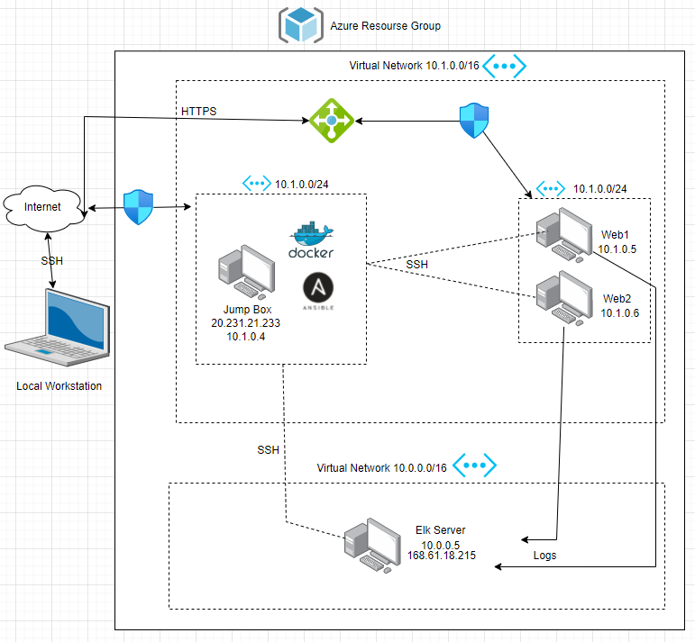
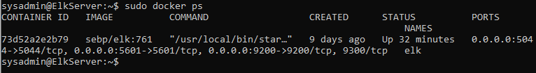

## Automated ELK Stack Deployment

The files in this repository were used to configure the network depicted below.

### Network Diagram

These files have been tested and used to generate a live ELK deployment on Azure. They can be used to either recreate the entire deployment pictured above. Alternatively, select portions of the _____ file may be used to install only certain pieces of it, such as Filebeat.

### Playbook Files
-[Filebeat Playbook](./ansible/filebeat-playbook.yml) 
-[Metric Playbook](./ansible/metric-playbook.yml) 

This document contains the following details:
- Description of the Topologu
- Access Policies
- ELK Configuration
  - Beats in Use
  - Machines Being Monitored
- How to Use the Ansible Build

### Description of the Topology

The main purpose of this network is to expose a load-balanced and monitored instance of DVWA, the D*mn Vulnerable Web Application.

Load balancing ensures that the application will be highly availability, in addition to restricting access to the network.  
-What aspect of security do load balancers protect? The off-loading function of a load balancer defends an organization against distributed denial-of-service (DDoS) attacks   
-What is the advantage of a jump box? Jump box prevents all Azure VM’s to expose to the public, By using the network security group   

Integrating an ELK server allows users to easily monitor the vulnerable VMs for changes to the network and system logs.   
- What does Filebeat watch for?  Filebeat monitors the log files or locations that you specify, collects log events, and forwards them either to Elasticsearch or Logstash for indexing  
- What does Metricbeat record? takes the metrics and statistics that it collects and ships them to the output that you specify, such as Elasticsearch or Logstash   

The configuration details of each machine may be found below.
_Note: Use the [Markdown Table Generator](http://www.tablesgenerator.com/markdown_tables) to add/remove values from the table_.

| Name      | Function   | IP Address | Operating System |
|-----------|------------|------------|------------------|
| Jump Box  | Gateway    | 10.1.0.4   | Linux            |
| Web-1     | WebServer  | 10.1.0.5   | Linux            |
| Web-2     | WebServer  | 10.1.0.6   | Linux            |
| Elk Server| Logs Server| 10.0.0.5   | Linux            |

### Access Policies

The machines on the internal network are not exposed to the public Internet. 

Only the Jump Box machine can accept connections from the Internet. Access to this machine is only allowed from the following IP addresses:
IP Address: 70.121.84.241

Machines within the network can only be accessed by Ansible container.
-Which machine did you allow to access your ELK VM? My local Machine What was its IP address? 70.121.84.241

A summary of the access policies in place can be found in the table below.

| Name       | Publicly Accessible | Allowed IP Addresses |
|------------|---------------------|----------------------|
| Jump Box   | Yes                 | 20.124.29.185        |
| Elk Server | Yes                 | 168.61.18.215        |
| Web-1      | No                  | 10.1.0.5             |
| Web-2      | No                  | 10.1.0.6             |

### Elk Configuration

Ansible was used to automate configuration of the ELK machine. No configuration was performed manually, which is advantageous because...
-What is the main advantage of automating configuration with Ansible? Very easy to use, we can send configurations to all instances at the same time

The playbook implements the following tasks:
In 3-5 bullets, explain the steps of the ELK installation play. E.g., install Docker; download image; etc._
-Install docker.io
-Install pip3
-Install docker python module
-Configure sysctl
-Download and launch elk container

The following screenshot displays the result of running `docker ps` after successfully configuring the ELK instance.

### Target Machines & Beats
This ELK server is configured to monitor the following machines:
- Web-1 with the ip address 10.1.0.5
- Web-2 with the ip address 10.1.0.6

We have installed the following Beats on these machines:
- Filebeat
- MetricBeat

These Beats allow us to collect the following information from each machine:
- Filebeat collects audit logs, deprecation logs, gc logs, server logs, and slow logs
- MetricBeat takes the metrics and statistics that it collects and ships them to the output that you specify, such as Elasticsearch or Logstash

### Using the Playbook
In order to use the playbook, you will need to have an Ansible control node already configured. Assuming you have such a control node provisioned: 

SSH into the control node and follow the steps below:
- Copy the filebeat and metricbeat configuration files to ansible container.
- Update the configuration files to include the IP address of Elk Server
- Run the playbook, and navigate to "http://ElkServerIP:5601/app/kibana#/home" to check that the installation worked as expected.

- You are going to need the following files: filebeat-playbook.yml and metric-playbook.yml you will copy those files the ansible container in the following directory /etc/ansible/roles
- You will need to update the following files filebeat-config.yml & metricbeat-configuration.yml, you will modify the lines 1106 and 1806 with ElkServer private IP address 10.0.0.5
- To check that its working go to http://ELKServer IP:5601/app/kibana#/home
 